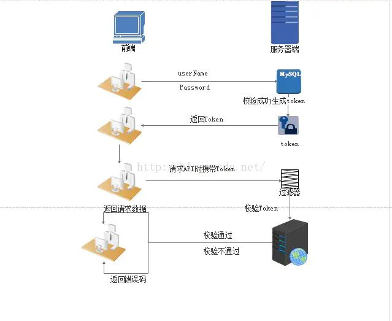

<font face="微软雅黑" size="2">

## token
- [token](#token)
  - [1. Cookie](#1-cookie)
    - [1.1 工作原理](#11-工作原理)
    - [1.2 缺点](#12-缺点)
  - [2. Session](#2-session)
    - [2.1 工作原理](#21-工作原理)
    - [2.2 缺点](#22-缺点)
  - [3.  Cookie 与 Session 的区别和联系](#3--cookie-与-session-的区别和联系)
  - [4. 基于 token 的认证方式](#4-基于-token-的认证方式)
    - [4.1 基于服务器验证方式暴露的一些问题](#41-基于服务器验证方式暴露的一些问题)
    - [4.2 基于 Token 的身份验证的过程如下:](#42-基于-token-的身份验证的过程如下)
    - [4.3 Tokens 的优势](#43-tokens-的优势)
    - [4.4 token 有效期设置](#44-token-有效期设置)
    - [4.5 项目中使用 token 总结](#45-项目中使用-token-总结)
### 1. Cookie
#### 1.1 工作原理

- **Cookie 指的就是在浏览器里面存储的一种数据，仅仅是浏览器实现的一种数据存储功能。** 由于HTTP是一种无状态的协议，服务器单从网络连接上无从知道客户身份，因此服务器可以通过 Cookie 来确认客户身份。Cookie 的保存时间，可以自己在程序中设置。如果没有设置保存时间，应该是一关闭浏览器， Cookie 就自动消失。

- **Cookie** 实际上是一小段的文本信息。客户端请求服务器，如果服务器需要记录该用户状态，就使用 **response 向客户端浏览器颁发一个 Cookie** 。客户端浏览器会把 Cookie 保存起来。当浏览器再请求该网站时，浏览器把请求的网址连同该 Cookie 一同提交给服务器。服务器检查该 Cookie ，以此来辨认用户状态。服务器还可以根据需要修改 Cookie 的内容。

#### 1.2 缺点 
Cookie功能需要浏览器的支持。如果浏览器不支持 Cookie（如大部分手机中的浏览器）或者把 Cookie 禁用了，Cookie 功能就会失效。不同的浏览器采用不同的方式保存 Cookie。IE浏览器会以文本文件形式保存，一个文本文件保存一个 Cookie。

Cookie 的不可跨域名性：
- Cookie 具有不可跨域名性。根据 Cookie 规范，浏览器访问 Google 只会携带 Google 的 Cookie ，而不会携带 Baidu 的 Cookie。浏览器判断一个网站是否能操作另一个网站 Cookie 的依据是域名。

### 2. Session
#### 2.1 工作原理
- Session 是另一种记录客户状态的机制，不同的是 Cookie 保存在客户端浏览器中，而 Session 保存在服务器上。客户端浏览器访问服务器的时候，服务器把客户端信息以某种形式记录在服务器上。这就是 Session 。客户端浏览器再次访问时只需要从该 Session 中查找该客户的状态就可以了。
- 服务器使用 Session 把用户的信息临时保存在了服务器上，用户离开网站后 Session 会被销毁。这种用户信息存储方式相对 Cookie 来说更安全。

#### 2.2 缺点
- 如果web服务器做了负载均衡，那么下一个操作请求到了另一台服务器的时候session会丢失。Session的使用比Cookie方便，但是过多的Session存储在服务器内存中，会对服务器造成压力。

### 3.  Cookie 与 Session 的区别和联系
1. cookie 数据存放在客户的浏览器上，session 数据放在服务器上；
2. cookie 不是很安全，别人可以分析存放在本地的 COOKIE 并进行 COOKIE欺骗，考虑到安全应当使用 session；
3. session 会在一定时间内保存在服务器上。当访问增多，会比较占用你服务器的性能。考虑到减轻服务器性能方面，应当使用 COOKIE；
4. 单个 cookie 在客户端的限制是3K，就是说一个站点在客户端存放的 COOKIE 不能超过3K；

> Cookie和Session的方案虽然分别属于客户端和服务端，但是服务端的session的实现对客户端的cookie有依赖关系的，上面我讲到服务端执行session机制时候会生成session的id值，这个id值会发送给客户端，客户端每次请求都会把这个id值放到http请求的头部发送给服务端，而这个id值在客户端会保存下来，保存的容器就是cookie，因此当我们完全禁掉浏览器的cookie的时候，服务端的session也会不能正常使用。

### 4. 基于 token 的认证方式
在大多数使用Web API的互联网公司中，tokens 是多用户下处理认证的最佳方式。
#### 4.1 基于服务器验证方式暴露的一些问题
1. **Seesion**：每次认证用户发起请求时，服务器需要去创建一个记录来存储信息。当越来越多的用户发请求时，内存的开销也会不断增加。
2. **可扩展性**：在服务端的内存中使用Seesion存储登录信息，伴随而来的是可扩展性问题。
3. **CORS(跨域资源共享)**：当我们需要让数据跨多台移动设备上使用时，跨域资源的共享会是一个让人头疼的问题。在使用 Ajax 抓取另一个域的资源，就可以会出现禁止请求的情况。
4. **CSRF(跨站请求伪造)**：用户在访问银行网站时，他们很容易受到跨站请求伪造的攻击，并且能够被利用其访问其他的网站。

在这些问题中，**可扩展性**是最突出的。因此我们有必要去寻求一种更有行之有效的方法。

#### 4.2 基于 Token 的身份验证的过程如下:
1. 用户通过用户名和密码发送请求。
2. 服务器端程序验证。
3. 服务器端程序返回一个带签名的 token 给客户端。
4. 客户端储存 token ,并且每次访问 API 都携带 token 到服务器端的。
5. 服务端验证 token ，校验成功则返回请求数据，校验失败则返回错误码。

<p align="center">
  
</p>

#### 4.3 Tokens 的优势
1. **无状态、可扩展**
- 在客户端存储的 Tokens 是无状态的，并且能够被扩展。基于这种无状态和不存储 Session 信息，负载负载均衡器能够将用户信息从一个服务传到其他服务器上。tokens 自己 hold 住了用户的验证信息。

2. **安全性**
- 请求中发送 token 而不再是发送 cookie 能够防止 CSRF(跨站请求伪造) 。即使在客户端使用 cookie 存储 token ， cookie 也仅仅是一个存储机制而不是用于认证。不将信息存储在 Session 中，让我们少了对 session 操作。
- token 是有时效的，一段时间之后用户需要重新验证。

3. **可扩展性**
- Tokens 能够创建与其它程序共享权限的程序。
4. **多平台跨域**
- 我们提前先来谈论一下 CORS(跨域资源共享) ，对应用程序和服务进行扩展的时候，需要介入各种各种的设备和应用程序。

#### 4.4 token 有效期设置
一种方案，使用 Refresh Token，它可以避免频繁的读写操作。这种方案中，服务端不需要刷新 Token 的过期时间，一旦 Token 过期，就反馈给前端，前端使用 Refresh Token 申请一个全新Token 继续使用。这种方案中，服务端只需要在客户端请求更新 Token 的时候对 Refresh Token 的有效性进行一次检查，大大减少了更新有效期的操作，也就避免了频繁读写。当然 Refresh Token 也是有有效期的，但是这个有效期就可以长一点了，比如，以天为单位的时间。

#### 4.5 项目中使用 token 总结
使用基于 Token 的身份验证方法，在服务端不需要存储用户的登录记录。大概的**流程**是这样的：
1. 前端使用用户名跟密码请求首次登录
2. 后服务端收到请求，去验证用户名与密码是否正确
3. 验证成功后，服务端会根据用户id、用户名、定义好的秘钥、过期时间生成一个 Token，再把这个 Token 发送给前端
4. 前端收到 返回的Token ，把它存储起来，比如放在 Cookie 里或者 Local Storage 里
   ```js
   export interface User {
   token: string;
   userInfo: UserInfo | any;
   companyInfo: CompanyInfo | any;
   resources?: string[];
   }
   ```

   ```js
   save(key: string, value: any, storageType ?: StorageType) {
       return this.storageService.put(
           {
               pool: key,
               key: 'chris-app',
               storageType: StorageType.localStorage
           },
           value
       );
   } 
   this.storageService.save(CACHE_USER_KEY, user);
   ```
5. 前端每次路由跳转，判断 localStroage 有无 token ，没有则跳转到登录页。有则请求获取用户信息，改变登录状态；
6. 前端每次向服务端请求资源的时候需要在请求头里携带服务端签发的Token
   ```js
   HttpInterceptor => headers = headers.set('token', this.authService.getToken());
   ```
7. 服务端收到请求，然后去验证前端请求里面带着的 Token。没有或者 token 过期，返回401。如果验证成功，就向前端返回请求的数据。

8. 前端得到 401 状态码，重定向到登录页面。
   ```js
   HttpInterceptor => 
       401: '用户登陆状态失效，请重新登陆。'
   ```

> 作者：chrisghb<br>
> 来源：https://www.jianshu.com/p/a32634a5170c