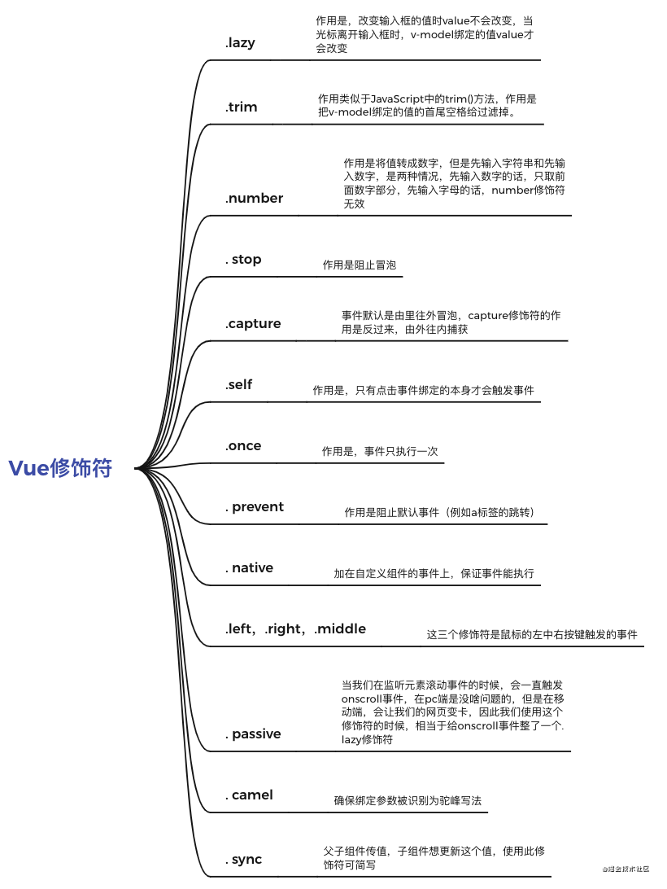
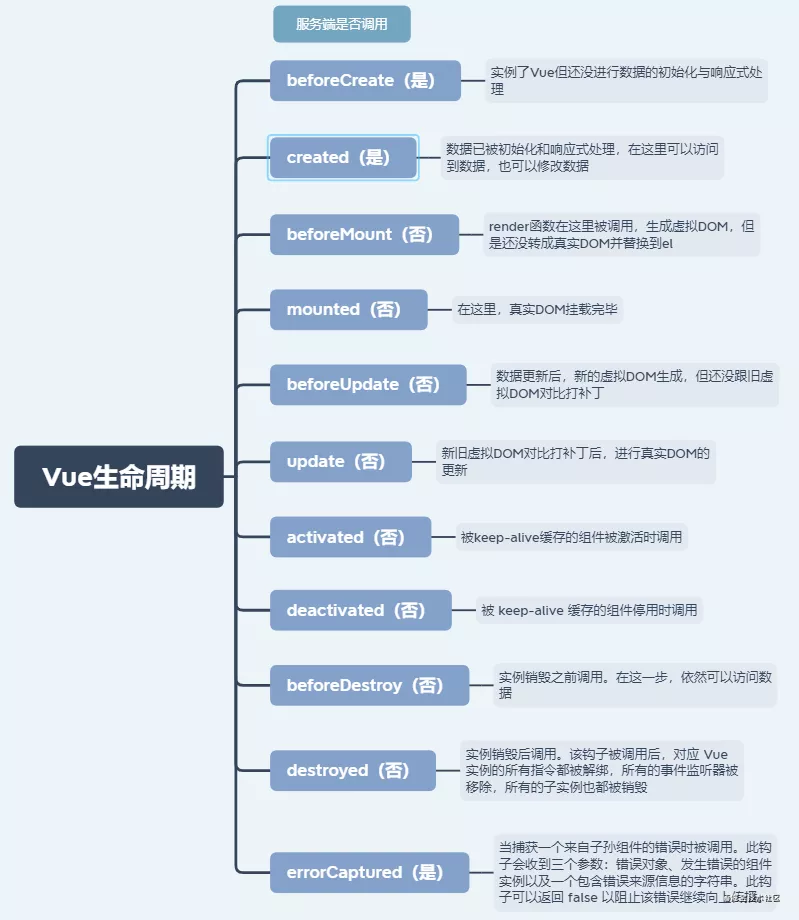

<font size=2 face="微软雅黑">

## Vue
- [Vue](#vue)
  - [1、vue修饰符（13种）](#1vue修饰符13种)
  - [2、vue生命周期](#2vue生命周期)
  - [3、API：set、delete](#3apisetdelete)
  - [4、插槽（slot）](#4插槽slot)
  - [4、nextTick](#4nexttick)
  - [5、虚拟DOM](#5虚拟dom)

### 1、vue修饰符（13种）
<p align="center">
  
</p>

### 2、vue生命周期
<p align="center">
  
</p>

### 3、API：set、delete
**对象新属性无法更新视图，删除属性无法更新视图**

1. 向响应式对象中添加一个 `property`，并确保这个新 `property` 同样是响应式的，且触发视图更新。<br>
添加属性：`Vue.set(obj, key, value)` === `vm.$set(obj, key, value)`

2. 删除对象的 `property`。如果对象是响应式的，确保删除能触发更新视图。<br>
删除属性：`Vue.delete(obj, key)`  === `vm.$delete(obj, key)`

3. 修改数组的值用`splice`或者 `Vue.set(arr, index, value)`


### 4、插槽（slot）
**1、编译作用域 （父组件在子组件<slot></slot>处插入 data）**

```js
//父组件：（引用子组件 child）
<template>
  <div class= 'app'>
     <child> {{ parent }}</child>   
  </div>
</template>

new Vue({
  el:'.app',
  data:{
    parent:'父组件'
  }
})

//子组件 ： (假设名为：child)
<template>
  <div class= 'child'>
      <slot></slot>
  </div>
</template>
```
> 父级模板里的所有内容都是在父级作用域中编译的；子模板里的所有内容都是在子作用域中编译的。

**2、后备内容 (子组件<slot></slot>设置默认值)**
```js
//子组件 ： (假设名为：child)
<template>
  <div class='child'>
      <slot>这就是默认值</slot>
  </div>
</template>
```
当父组件提供插槽内容的时候该后备内容将被取代

**3、具名插槽 （子组件多个<slot></slot>对应插入内容）**

子组件`base-layout`
```js
// 子组件(组件名为base-layout）
<div class="container">
  <header>
    <!-- 我们希望把页头放这里 -->
  </header>
  <main>
    <!-- 我们希望把主要内容放这里 -->
  </main>
  <footer>
    <!-- 我们希望把页脚放这里 -->
  </footer>
</div>
```
<p style="text-align:center">↓</p>

```js
<div class="container">
  <header>
    <slot name="header"></slot>
  </header>
  <main>
    <slot></slot>    
    
  </main>
  <footer>
    <slot name="footer"></slot>
  </footer>
</div>
```
> **一个不带 name 的 <slot> 出口会带有隐含的名字`default`。**

父组件
```js
<div>
  <base-layout>
    <template v-slot:header>
      <h1>Here might be a page title</h1>
    </template>

    // <template v-slot:default>  可省略
      <p>A paragraph for the main content.</p>
      <p>And another one.</p>
    // </template>

    <template v-slot:footer>
      <p>Here's some contact info</p>
    </template>
  </base-layout>
</div>
```
- 最终渲染结果
```js
<div>
  <div class="container">
    <header>
      <h1>Here might be a page title</h1>
    </header>
    <main>
      <p>A paragraph for the main content.</p>
      <p>And another one.</p>
    </main>
    <footer>
      <p>Here's some contact info</p>
    </footer>
  </div>
</div>
```

**4、作用域插槽 (父组件在子组件<slot></slot>处使用子组件 data)**
（用的不多，暂略）


### 4、nextTick
Vue是异步更新，所以数据一更新，视图却还没更新，所以拿到的还是上一次的旧视图数据，想要拿到最新视图数据需要用nextTick方法
```js
<template>
  <div refs="div">
    hello world
  </div>
</template>

this.$nextTick(() => {
    console.log(this.$refs.div.innerHTML)   //hello world
})
```
### 5、虚拟DOM
虚拟 `DOM` 相当于在 `js` 和真实 `DOM` 中间加了一个缓存，利用dom diff算法避免了没有必要的 `DOM` 操作，从而提高性能。

具体实现步骤如下：
1. 用 `JavaScript` 对象结构表示 `DOM` 树的结构；然后用这个树构建一个真正的 `DOM` 树，插到文档当中
2. 当状态变更的时候，重新构造一棵新的对象树。然后用新的树和旧的树进行比较，记录两棵树差异
3. 把2所记录的差异应用到步骤1所构建的真正的 `DOM` 树上，视图就更新了。


> 作者：Sunshine_Lin<br>
> 链接：https://juejin.cn/post/6984210440276410399