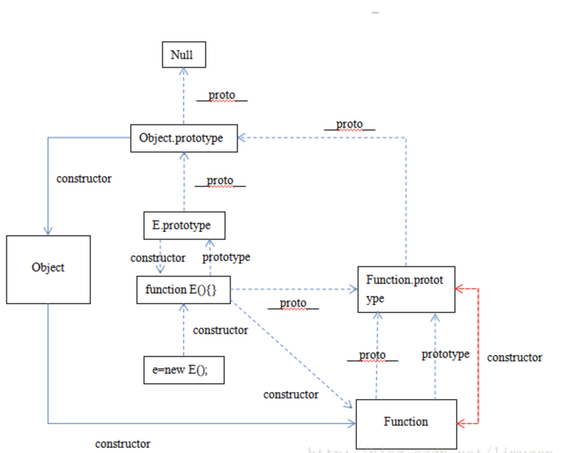

<font face="微软雅黑" size=2>

## JavaScript
- [JavaScript](#javascript)
  - [1、实现sum(1)(2)(3)](#1实现sum123)
  - [2、深拷贝](#2深拷贝)
  - [3、去重](#3去重)
  - [4、new操作中发生了什么？](#4new操作中发生了什么)
  - [5、快速排序](#5快速排序)
  - [6、四种设计模式](#6四种设计模式)
  - [7、创建实例的方法](#7创建实例的方法)
  - [8、前端事件流](#8前端事件流)
  - [9、原型关系](#9原型关系)
  - [10、原型 / 构造函数 / 实例](#10原型--构造函数--实例)
  
### 1、实现sum(1)(2)(3)
```js
function sum(x) {
  let num = x;
  let tmp = function (y) {
    num = num + y;
    return tmp;
  }
  tmp.toString = function () {
    return num;
  };
  return tmp;
}

console.log(sum(1)(2)(3));  // 6
```


>首先要一个数记住每次的计算值，所以使用了闭包，在 tmp 中记住了 x 的值，第一次调用 sum() ,初始化了 tmp，并将 x 保存在 tmp 的作用链中，然后返回 tmp 保证了第二次调用的是 tmp 函数，后面的计算都是在调用 tmp, 因为 tmp 也是返回的自己，保证了第二次之后的调用也是调用 tmp，而在 tmp 中将传入的参数与保存在作用链中 x 相加并付给 num，这样就保证了计算；

>但是在计算完成后还是返回了 tmp 这个函数，这样就获取不到计算的结果了，我们需要的结果是一个计算的数字那么怎么办呢，首先要知道 JavaScript 中，打印和相加计算，会分别调用 toString 或 valueOf 函数，所以我们重写 tmp 的 toString 和 valueOf 方法，返回 num 的值；

**实现sum(1)(2)(3)()**
```js
const sum = a => b => b ? sum( a + b ) : a;
console.log(sum(1)(2)(3)());
```

### 2、深拷贝
如果在拷贝这个对象的时候，**只对基本数据类型进行了拷贝，而对引用数据类型只是进行了引用的传递**，而没有重新创建一个新的对象，则认为是**浅拷贝**。反之，在对引用数据类型进行拷贝的时候，**创建了一个新的对象**，并且复制其内的成员变量，则认为是**深拷贝**。

**1. 手写深拷贝**
```js
// 深拷贝
function cloneDeep(target) {
  if(typeof target === 'object') {
    const result = Array.isArray(target) ? [] : {};
    for(let i in target) {
      if(typeof target[i] === 'object') {
        result[i] = cloneDeep(target[i]);
      } else {
        result[i] = target[i]; 
      }
    }
    return result;
  } else if(typeof target === 'function') {
    return new Function('return ' + target )();
  } else {
    return target;
  }
}
```
**2. lodash里的_.cloneDeep方法**
```js
// lodash里的_.cloneDeep方法
let obj = {name:[{firstname:'kui'},{lastName:'deng'}]}
 
let cloneObj = _.cloneDeep(obj);
console.log(cloneObj === obj);
// => false
```
**3. ···扩展运算符**
```js
let obj = {name:[{firstname:'kui'},{lastName:'deng'}]}

let cloneObj = {...obj};
```


**4. JSON.parse(JSON.stringify(obj))**
```js
// JSON.parse(JSON.stringify(obj))
let obj = {name:[{firstname:'kui'},{lastName:'deng'}]}
let cloneObj = JSON.parse(JSON.stringify(obj));
```

**5. Object.assign方法**
```js
// Object.assign方法
let obj = {name:[{firstname:'kui'},{lastName:'deng'}]}
let cloneObj = Object.assign({}, obj);
```

**6. Object.getOwnPropertyDescriptors方法**
```js
// Object.getOwnPropertyDescriptors方法
let obj = {name:[{firstname:'kui'},{lastName:'deng'}]}
let cloneObj = Object.defineProperties({}, Object.getOwnPropertyDescriptors(obj));
```
### 3、去重
```js
// 方式1：Set去重
function unique(arr) {
  return Array.from(new Set(arr));
}
```

```js
// 方式2：空间换时间
function unique(arr) {
  const res = [];
  const map = new Map();

  for(let val of arr) {
    if(!map.has(val)) {
      res.push(val);
      map.set(val,true)
    }
  }
  return res
}

```
### 4、new操作中发生了什么？
> 原文链接：https://www.cnblogs.com/echolun/p/10903290.html
> https://www.cnblogs.com/echolun/p/10110839.html
- new一个实例
```js
// es5
const Parent = function (name, age) {
  this.name = name;
  this.age = age;
}
Parent.prototype.sayHi = function () {
  console.log('hi');
}
const child = new Parent();
child.sayHi()

// es6 是es5的语法糖
class Parent {
  constructor (name, age) {
    this.name = name;
    this.age = age;
  };
  sayHi () {
    console.log('hi');
  };
}
const child = new Parent();
child.sayHi();

```

**new 一个对象过程中，主要发生了以下步骤：**

1. 以构造器的prototype属性为原型，创造一个新的、空的对象
2. 将它的引用赋给构造器的 this，同时将参数传到构造器中执行
3. 如果构造器没有手动返回对象，则返回第一步创建的新对象，如果有，则舍弃掉第一步创建的新对象，返回手动return的对象。

```js
// 构造器函数
let Parent = function(name,age) {
  this.name = name;
  this.age = age;
}
Parent.prototype.sayHi = function() {
  console.log('hi');
}
//自己定义的new方法
const newMethod = function(Parent, ...rest) {
  // 1.以构造器的prototype属性为原型，创造一个新的、空的对象
  let child = Object.create(Parent.prototype);
  // 2.将它的引用赋给构造器的 this
  let result = Parent.apply(child, rest);
  // 3.如果构造器没有手动返回对象，则返回第一步创建的新对象
  return typeof result === 'object' ? result : child;
}
//创建实例，将构造函数Parent与形参作为参数传入
const child = newMethod(Parent,'kankan','23');
console.log(child.name);
console.log(child.age);
console.log(child.sayHi());

//最后检验，与使用new的效果相同
console.log(child instanceof Parent);
console.log(child.hasOwnProperty('name'));
console.log(child.hasOwnProperty('age'));
console.log(child.hasOwnProperty('sayHi'));
```

### 5、快速排序
```js
const quickSort = (array) => {
  const sort = (arr, left = 0, right = arr.length - 1) => {
    if (left >= right) {//如果左边的索引大于等于右边的索引说明整理完毕
      return
    }
    let i = left
    let j = right
    const baseVal = arr[j] // 取无序数组最后一个数为基准值
    while (i < j) {//把所有比基准值小的数放在左边大的数放在右边
      while (i < j && arr[i] <= baseVal) { //找到一个比基准值大的数交换
        i++
      }
      arr[j] = arr[i] // 将较大的值放在右边如果没有比基准值大的数就是将自己赋值给自己（i 等于 j）
      while (j > i && arr[j] >= baseVal) { //找到一个比基准值小的数交换
        j--
      }
      arr[i] = arr[j] // 将较小的值放在左边如果没有找到比基准值小的数就是将自己赋值给自己（i 等于 j）
    }
    arr[j] = baseVal // 将基准值放至中央位置完成一次循环（这时候 j 等于 i ）
    sort(arr, left, j - 1) // 将左边的无序数组重复上面的操作
    sort(arr, j + 1, right) // 将右边的无序数组重复上面的操作
  }
  const newArr = array.concat() // 为了保证这个函数是纯函数拷贝一次数组 
  sort(newArr)
  return newArr
}
console.log(quickSort([7,1,5,2,4,6,3]))
```

### 6、四种设计模式
**1. 工厂模式**：简单的工厂模式可以理解为解决多个相似的问题;
> 函数内部生成对象返回、类

**2. 单例模式**：只能被实例化（构造函数给实例添加属性与方法）一次
> 设置阀门，让构造函数只能实例化一次
```js
// 单例模式
let Singleton = function(name){
    this.name = name;
};
Singleton.prototype.getName = function(){
    return this.name;
}
// 获取实例对象
let getInstance = (function() {
    let instance = null;
    return function(name) {
        if(!instance) {//相当于一个一次性阀门,只能实例化一次
            instance = new Singleton(name);
        }
        return instance;
    }
})();
// 测试单体模式的实例,所以a===b
let a = getInstance("aa");
let b = getInstance("bb");  
```

**3. 沙箱模式**
> 将一些函数放到自执行函数里面,但要用闭包暴露接口,用变量接收暴露的接口,再调用里面的值,否则无法使用里面的值
```js
let sandboxModel=(function() {
    function sayName(name) {
      console.log('123',name)
    };
    function sayAge() {
      console.log('18')
    };
    return {
        sayName,
        sayAge
    }
})()

sandboxModel.sayName('dk');
sandboxModel.sayAge();
```
4. 发布者订阅模式
> 就例如我们关注了某一个公众号,然后他对应的有新的消息就会给你推送

### 7、创建实例的方法
1. 字面量
```js
let obj = {'name':'kk'}
```
2. Object构造函数
```js
let Obj = new Object()
Obj.name='kk'
```
3. 工厂模式
```js
function createPerson(name){
 let obj = new Object();
 obj.name = name;
 };
 return obj; 
}
let user = createPerson('kk');
```

4. 构造函数创建对象
```js
function Person(name) {
  this.name = name
}

let user = new Person('kk');
```

### 8、前端事件流
**事件流**：事件流描述的是从页面中接收事件的顺序,DOM2级事件流包括下面几个阶段。

- 事件捕获阶段
- 处于目标阶段
- 事件冒泡阶段

**addEventListener**：addEventListener是 DOM2 级事件新增的指定事件处理程序的操作。
- 这个方法接收3个参数：**要处理的事件名、作为事件处理程序的函数 和 一个布尔值**。最后这个布尔值参数如果是`true`，表示在**捕获阶段**调用事件处理程序；如果是`false`，表示在**冒泡阶段**调用事件处理程序。默认为`false`。

### 9、原型关系
<p align="center">
  
</p>

### 10、原型 / 构造函数 / 实例

- **原型(prototype)**: 一个简单的对象，用于实现对象的 属性继承。可以简单的理解成对象的爹。在 `Firefox` 和 `Chrome` 中，每个 `JavaScript` 对象中都包含一个 `__proto__` (非标准)的属性指向它爹(该对象的原型)，可 `obj.__proto__` 进行访问。
- **构造函数**: 可以通过 `new` 来新建一个对象的函数。
- **实例**: 通过构造函数和new创建出来的对象，便是实例。实例通过 `__proto__` 指向原型，通过 `constructor` 指向构造函数。

```js
// 构造函数
function Person(name) {
this.name = name;
}
// 创建实例
let user = new Person('kk');
console.log(user);    // Person {name: "kk"}

console.log(user.__proto__ === Person.prototype)    //true
console.log(Person.prototype.constructor === Person)    // true
// 基于上面两条
// user.__proto__.constructor === Person.prototype.constructor  === Person
console.log(user.constructor === Person)  // true 

// -------------------------------------------------
console.log(Person.constructor === Function);  //true
console.log(Person.__proto__ === Function.prototype);   // true

```